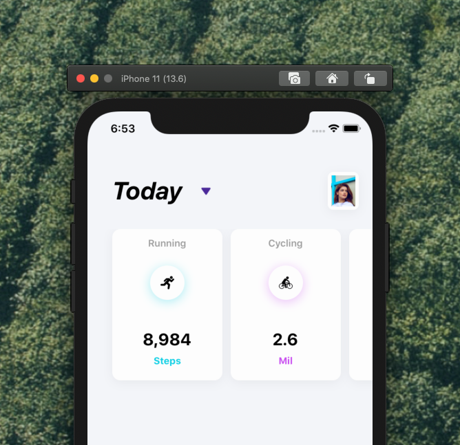

[](https://github.com/WrathChaos/react-native-beautiful-horizontal-list)

[](https://www.npmjs.com/package/react-native-beautiful-horizontal-list)
[](https://www.npmjs.com/package/react-native-beautiful-horizontal-list)

[](https://opensource.org/licenses/MIT)
[](https://github.com/prettier/prettier)

<p align="center">
  
</p>

# Installation

Add the dependency:

```ruby
npm i react-native-beautiful-horizontal-list
```

## Peer Dependencies

###### IMPORTANT! You need install them

```js
"react": ">= 16.x.x",
"react-native": ">= 0.55.x",
```

# Usage

## Import

```js
import BeautifulHorizontalList from "react-native-beautiful-horizontal-list";
```

## Basic Usage

```js
<BeautifulHorizontalList data={yourDataArray} />
```

## Data Format

Data format MUST like this. It will handle the colors and all the other props from data itself.

```js
const staticData = [
  {
    title: "Running",
    value: "8,984",
    unit: "Steps",
    primaryColor: "#10CFE4",
    imageSource: require("./assets/run.png"),
  },
  {
    title: "Cycling",
    value: "2.6",
    unit: "Mil",
    primaryColor: "#c84cf0",
    imageSource: require("./assets/cyclist-silhouette.png"),
  },
  {
    title: "Swimming",
    value: "9501",
    unit: "Stoke",
    primaryColor: "#10E471",
    imageSource: require("./assets/swimmer.png"),
  },
];
```

# Configuration - Props

| Property           |   Type    | Default | Description                                                          |
| ------------------ | :-------: | :-----: | -------------------------------------------------------------------- |
| TextComponent      | component |  Text   | set your own Text component if you do not want to use default Text   |
| ImageComponent     | component |  Image  | set your own Image component if you do not want to use default Image |
| itemContainerStyle |   style   | default | set or override the original item container style                    |
| titleTextStyle     |   style   | default | set or override the original title text style                        |
| valueTextStyle     |   style   | default | set or override the original value text style                        |
| unitTextStyle      |   style   | default | set or override the original unit text style                         |

## Future Plans

- [x] ~~LICENSE~~
- [ ] Typescript Challenge!
- [ ] Write an article about the lib on Medium

# Credits

<span>Photo by <a href="https://unsplash.com/@armedshutter?utm_source=unsplash&amp;utm_medium=referral&amp;utm_content=creditCopyText">Ayo Ogunseinde</a> on <a href="https://unsplash.com/?utm_source=unsplash&amp;utm_medium=referral&amp;utm_content=creditCopyText">Unsplash</a></span>

Icons are from Flaticon.com 😋

Heavily inspired by [Faria Anzum](https://dribbble.com/shots/6164824-Hourly/attachments/1321895) 😍

## Author

FreakyCoder, kurayogun@gmail.com

## License

React Native Beautiful Horizontal List is available under the MIT license. See the LICENSE file for more info.
